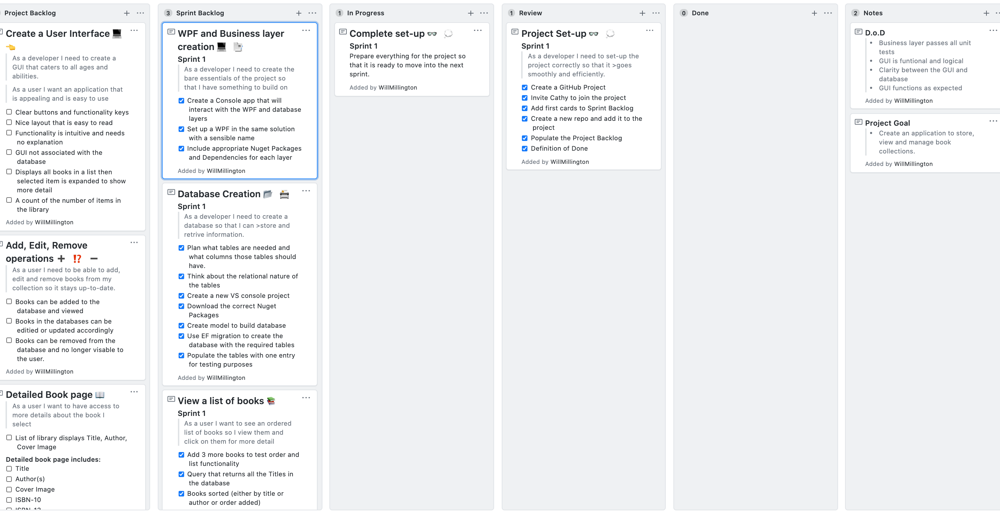
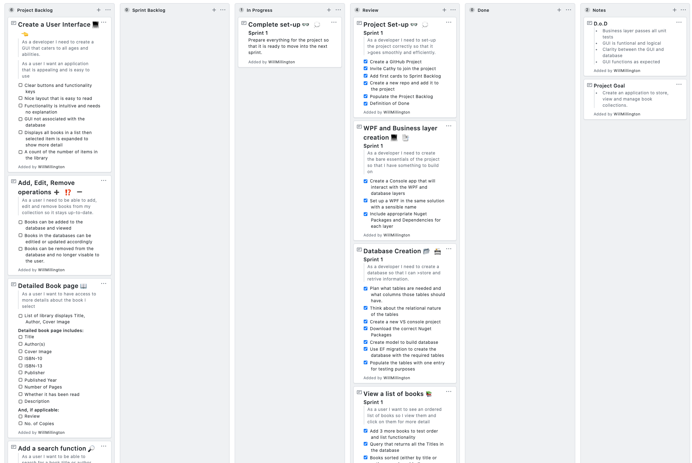

# Bibliocentric Application

From Monday 16th June to Monday 23rd June 2020 I plan to create an application that uses a backend database to store collections of books, a frontend GUI to view and edit the entries and a middle-manager to allow GUI to database interaction.

The Application is called Bibliocentric, from the Greek Biblio (meaning book) and kentrikos (meaning at the centre)

#### Project Goal:

> Create an application to store, view and manage book collections.

#### Definition of Done:

>- Business layer passes all unit tests
>- GUI is funtional and logical
>- Clarity between the GUI and database
>- GUI functions as expected

#### Sprint Layout

| Sprint Number | Date/Time Started | Date/Time Completed | Notes |
|:---------------:|:--------------:|:----------------:|:-------:|
|1| 15/06/2020 16:00 | 16/06/2020 16:48 | Project started smoothly. One issue with the Scaffold function but was resolved.|
|2| 16/06/2020 16:55 | 18/06/2020 | N/A|

Sprint 1
-
Prepare everything for the project so that it is ready to move into the next sprint.

Project Cards:
- Project Set-up
- Database Creation
- WPF and Business layer creation
- Basic retrive Queries

#### Retrospective
##### Start
- Writing unit tests as I go. Do not leave them all until the end of the sprint!

##### Continue

- Using the project board, updating individual tasks regularly
- Commit regularly to GitHub
- Updating README regularly

##### Stop
- Leaving Unit tests until the end

#### Screenshots

Start of Sprint 1 Project board

End of Sprint 1 Project board

***

Sprint 2
-
Create a new WPF with an initial GUI that lists books, in a chosen order and introduce Create, Read, Update, Delete Functionality

Project Cards:
- Create a User Interface
- Add, Edit, Remove operations
- Detailed Book page

#### Retrospective
##### Start
##### Continue

##### Stop

#### Screenshots

Start of Sprint 2 Project board

End of Sprint 2 Project board

***

