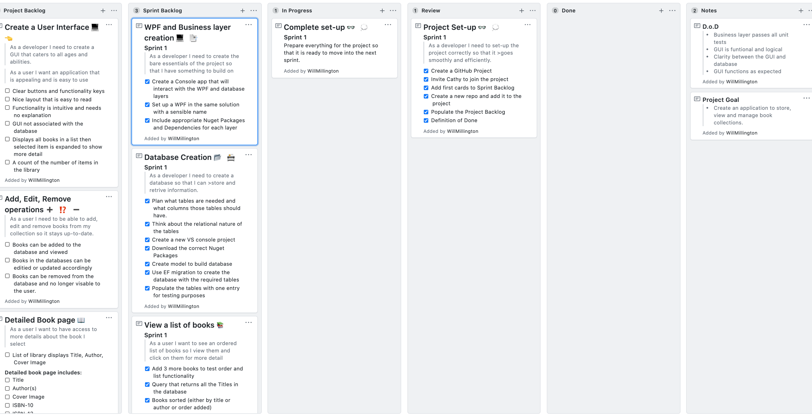
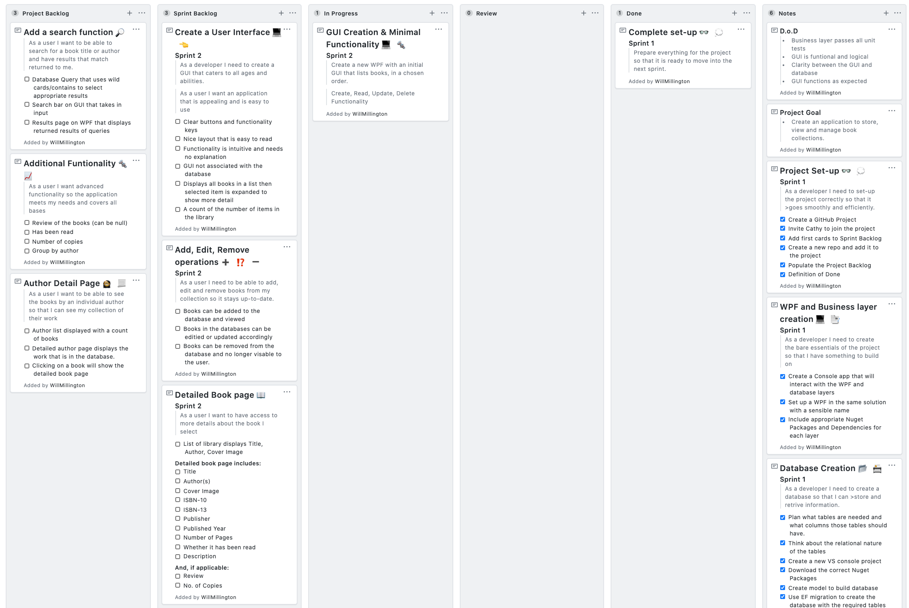
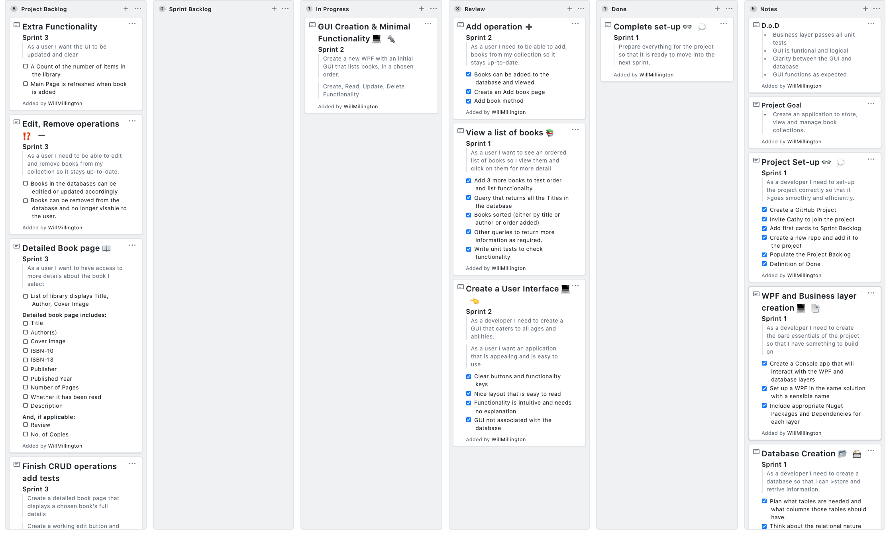
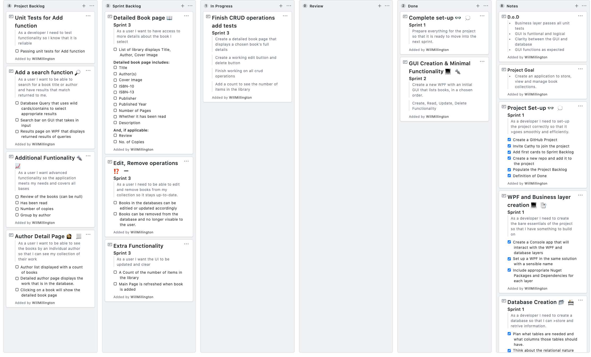
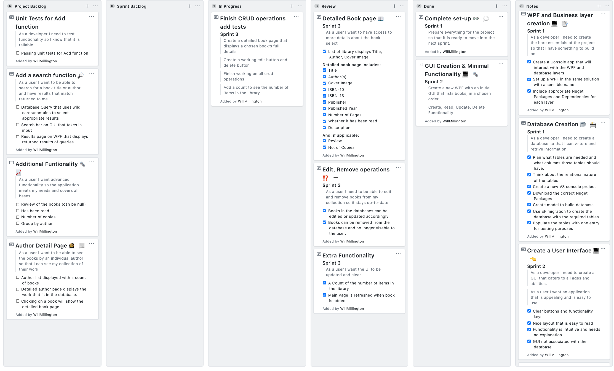
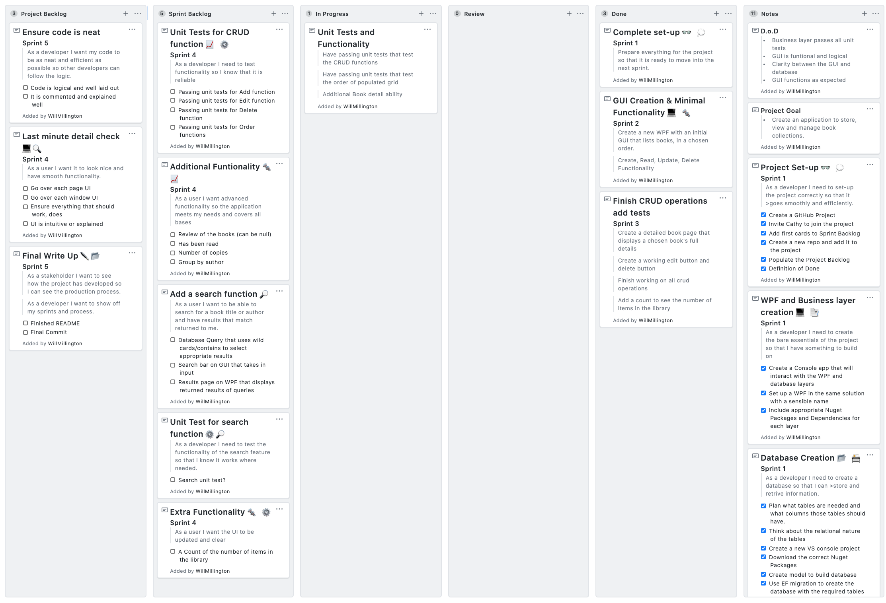
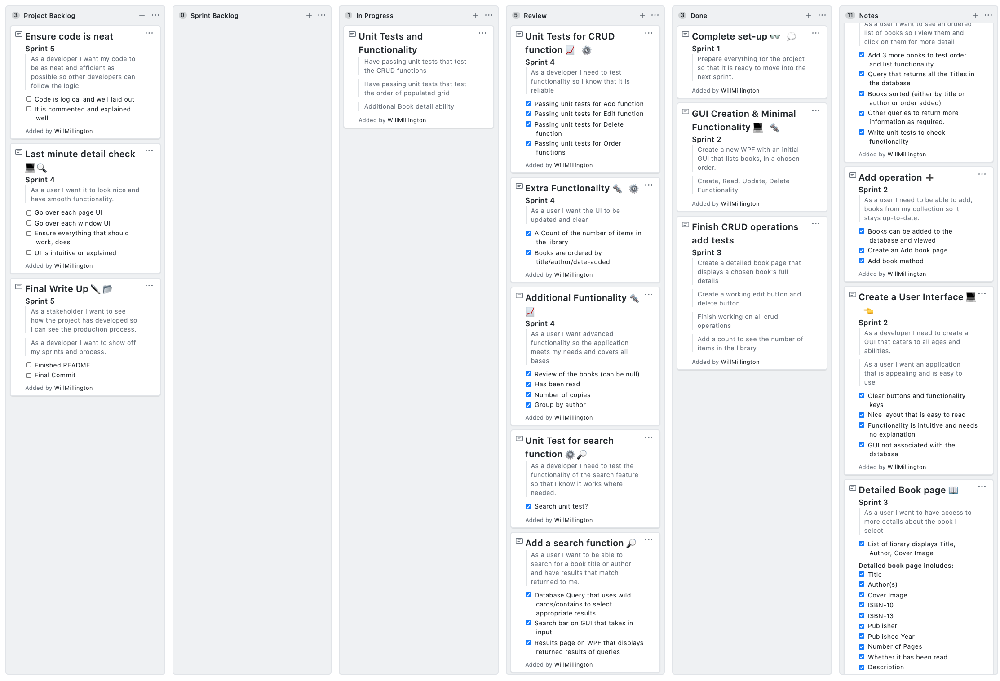
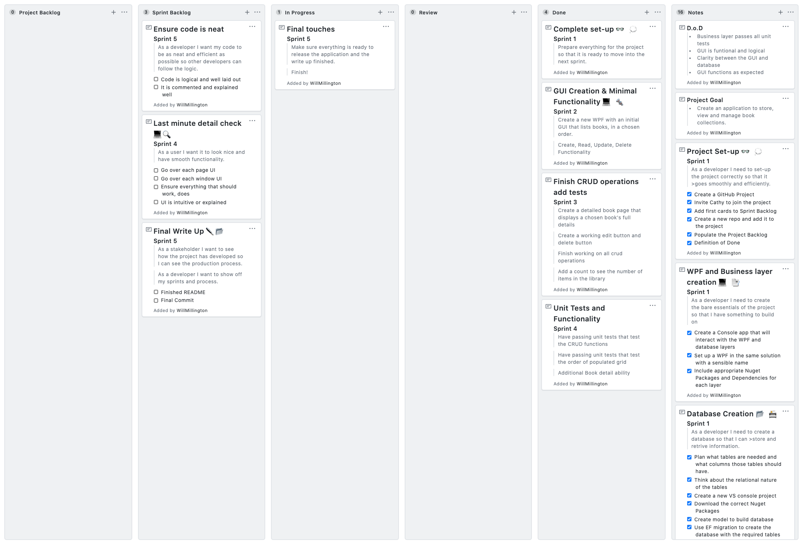
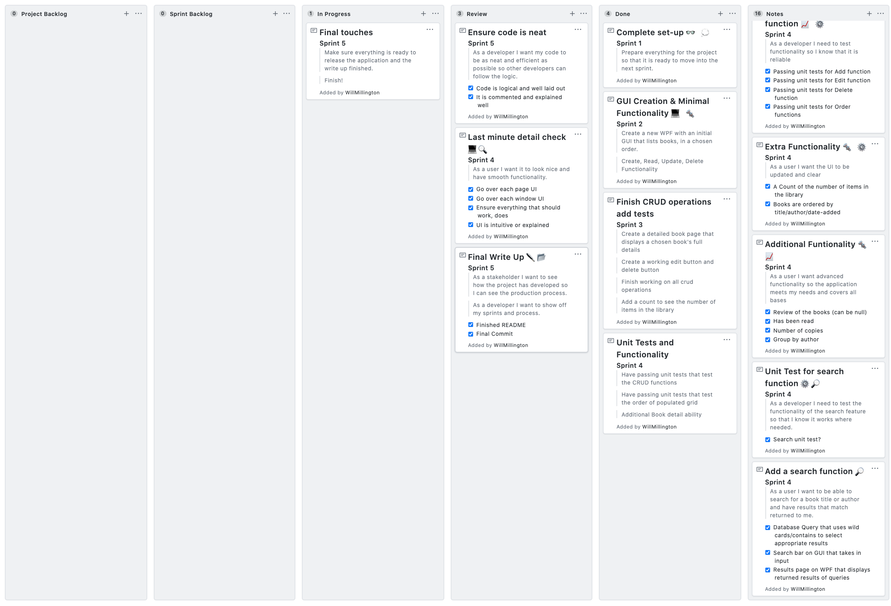
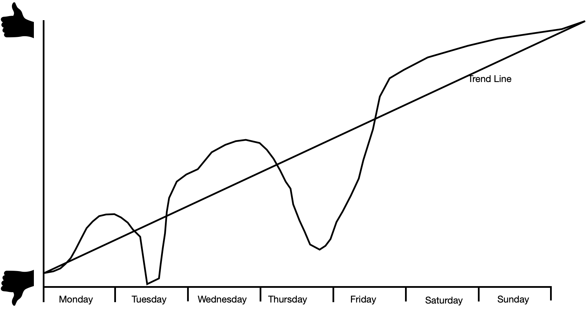

# Bibliocentric Application

From Monday 16th June to Monday 23rd June 2020 I plan to create an application that uses a backend database to store collections of books, a frontend GUI to view and edit the entries and a middle-manager to allow GUI to database interaction. 	

The app is form cataloging a personal book collection. I hope that the functionaity allows for an intuitive and smooth operation.

The Application is called Bibliocentric, from the Greek &#946;&#953;&#946;&#955;&#943;&#959;&#957; (Biblio: meaning book) and &#954;&#949;&#957;&#964;&#961;&#953;&#954;&#972;&#962; (kentrikos: meaning at the centre)

#### Project Goal:

> Create an application to store, view and manage book collections.

#### Definition of Done:

>- Business layer passes all unit tests
>- GUI is funtional and logical
>- Clarity between the GUI and database
>- GUI functions as expected

#### Sprint Layout

| Sprint Number | Date/Time Started | Date/Time Completed | Notes |
|:---------------:|:--------------:|:----------------:|:-------:|
|1| 15/06/2020 16:00 | 16/06/2020 16:48 | Project started smoothly. One issue with the Scaffold function but was resolved.|
|2| 16/06/2020 16:55 | 18/06/2020 08:43 | Issues regarding Adding method set the project back.|
|3| 18/06/2020 11:00 | 19/06/2020 12:40 | Major problems with display box, had to restart the UI process. Book page, edit, delete added.|

Sprint 1
-
Prepare everything for the project so that it is ready to move into the next sprint.

Project Cards:
- Project Set-up
- Database Creation
- WPF and Business layer creation
- Basic retrive Queries

#### Retrospective
##### Start
- Writing unit tests as I go. Do not leave them all until the end of the sprint!

##### Continue

- Using the project board, updating individual tasks regularly
- Commit regularly to GitHub
- Updating README regularly

##### Stop
- Leaving Unit tests until the end

#### Screenshots

Start of Sprint 1 Project board

End of Sprint 1 Project board

***

Sprint 2
-
Create a new WPF with an initial GUI that lists books, in a chosen order and introduce Create, Read, Update, Delete Functionality

Project Cards:
- Create a User Interface
- Add operation

#### Retrospective
##### Start
- Committing more regularly 

##### Continue
- Working hard, only resting when the work is complete

##### Stop
- Overcomplicating simple processes

#### Screenshots

Start of Sprint 2 Project board

End of Sprint 2 Project board

***

Sprint 3
-
Create a detailed book page that displays a chosen book's full details.
Create a working edit button and delete button.
Finish working on all crud operations.
Add a count to see the number of items in the library.

Project Cards:
- Detailed Book Page
- Edit, Remove operations
- Extra Functionality

#### Retrospective
##### Start
- Committing more regularly!!!!!!!! 

##### Continue
- Thinking about user first and incorporating that into the project

##### Stop
- Waiting to test UI functionality after it is set-up (It will break everything)

#### Screenshots

Start of Sprint 3 Project board

End of Sprint 3 Project board

***

Sprint 4
-
Have passing unit tests that test the CRUD functions. Have passing unit tests that test the order of populated grid. Additional Book detail ability

Project Cards:
- Unit Tests for CRUD function
- Extra Functionality
- Additional Functionality
- Add a search function 
- Unit tests for search function

#### Retrospective
##### Start
- Updating README more regularly so it isn't left until the end, so I don't forget things.

##### Continue

- Looking at details to make the UI more detailed, smooth and intuive.

##### Stop

- Wasting overcomplicating simple tasks.

#### Screenshots

Start of Sprint 4 Project board

End of Sprint 4 Project board

***

Sprint 5
-
Make sure everything is ready to release the application and the write up finished. Finish!

Project Cards:
- Ensure Code is neat
- Last minute detail check
- Final write-up

#### Retrospective
##### Start
- Focussing more on sprint cards/goal and not the project goal
##### Continue
- Working hard, being motivated, driven.
##### Stop
- Leaving important project documentation until the end of the sprint/project

Start of Sprint 5 Project board

End of Sprint 5 Project board 

***

Overall Project Retrospective
-

From this project I have learnt the power of Agile development and SCRUM practices. It has been good to split the overwhelming project in to manageable chuncks.

Each Sprint has presented their own challenges, but knowing that the backlog is smaller eases the potential pressure that could have built up.

Obviously I have learnt a lot about WPF, NUnit, C# and SQL over this process, however I have learnt more about my own drive and determination. I have found that I am more able to overcome issues better than I was aware.

All I have shown in this project is new to me, I have learnt it over the last 7 weeks. I have surprised myself with what I have created.

### At the Start of the project
- I was overwhelmed with the task
- I had no idea what to do for my projects
- I did not know where to start
- I was concerned about my own ability

### Throughout the project
- I grew in confidence
- I trusted my ability
- I allowed the agile process to help me structure the chaos 
- I did not let issues in the code throw me off-course

### At the End of the project
- I am happy with how I have learnt to handle issues
- I am very pleased with the result of my work
- I want to see how far I can take this applicaton in my own time

I am happy with how I taken to agile. It has shaped the project to be something I am proud of. The goal of moving towards a minimum viable product at the end of each sprint made it easy to see real progress and consistently test the UI functionality.

If I were to do this project again, I think the biggest thing I would do differently is to seek simple solutions to issues before trying overly complicated '*hacks*'.

To take this further, I would add "Lent out" functionality, book cover images and labelling for catergorisation (i.e. Ordered by title/author surname would be split by letter under the heading "A", "B", "C", etc.).

***
### Project Happiness graph

***
#### Class Diagram is in BiblioWPF under the name Bibliocentric.cd
#### Final Commit called "Final Commit of Project" 21/06/2020 at 16:10